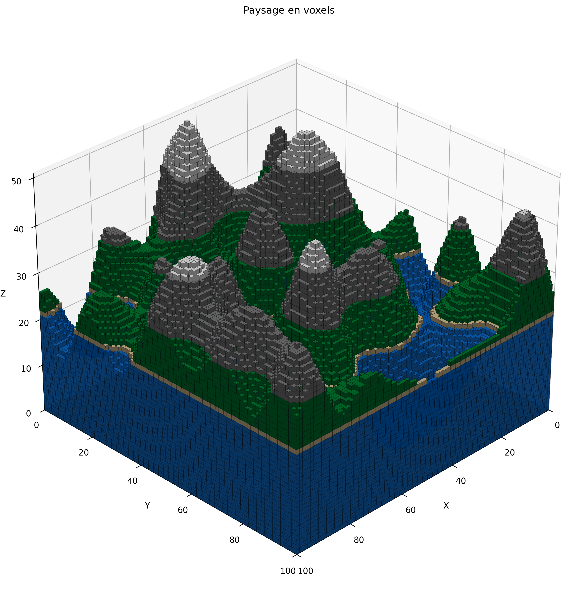
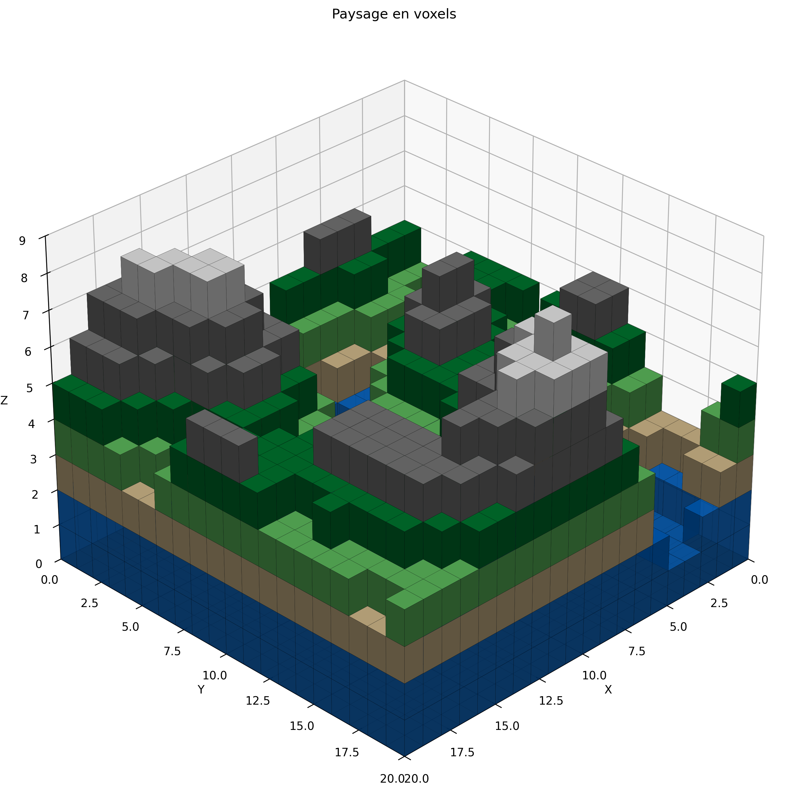
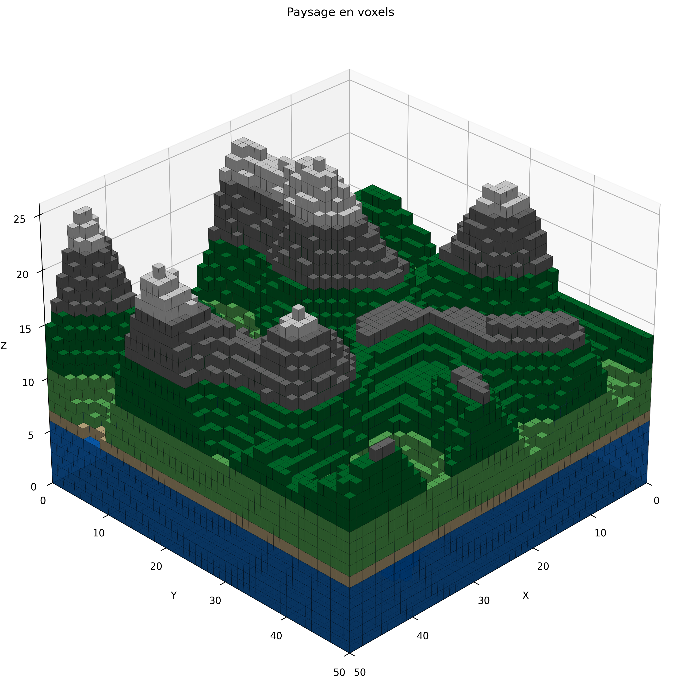
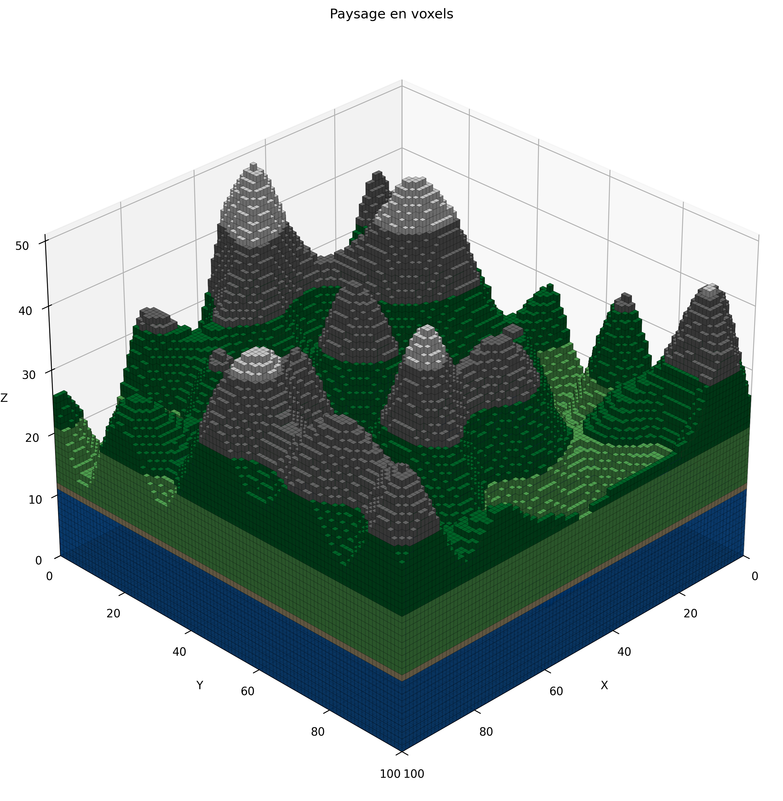

# Générateur de Paysages en Voxels (Terraforming)



Un générateur procédural de paysages en 3D utilisant des voxels, écrit en Python. Ce projet permet de créer des terrains avec différents biomes, basés sur l'altitude, grâce à un algorithme de bruit de Perlin.

## Fonctionnalités

- Génération procédurale de terrains avec du bruit de Perlin
- Représentation en voxels colorés 
- Différentes zones/biomes selon l'altitude:
  - Eau (bleu)
  - Plages (beige)
  - Plaines (vert clair)
  - Forêts (vert foncé)
  - Montagnes (gris)
  - Neige (blanc)
- Identifiant unique pour chaque paysage généré
- Barres de progression pendant la génération
- Paramètres personnalisables

## Prérequis

- Python 3.6+
- Les bibliothèques suivantes:
  ```
  pip install numpy matplotlib perlin-noise tqdm
  ```

## Installation

1. Clonez ce repository:
   ```
   git clone https://github.com/Le-Stef/voxel-landscape-generator.git
   cd voxel-landscape-generator
   ```

2. Installez les dépendances:
   ```
   pip install -r requirements.txt
   ```

## Utilisation

Exécutez le script principal:

```
python voxel_landscape_generator.py
```

### Paramètres personnalisables

Vous pouvez modifier les paramètres suivants dans la fonction `main()` du script:

| Paramètre | Description |
|-----------|-------------|
| `size` | Taille du terrain (size x size voxels) |
| `height_factor` | Facteur d'amplification de la hauteur |
| `octaves` | Nombre d'octaves pour le bruit de Perlin (plus = plus détaillé) |
| `seed` | Graine pour la génération aléatoire |
| `water_level` | Niveau d'eau (proportion de la hauteur maximale) |

### Exemple de sortie console

```
Génération d'un paysage en voxels (seed: 42, ID: a1b2c3d4e5f6)...
Génération du terrain de base...
Création du terrain: 100%|███████████████████| 20/20 [00:00<00:00, 245.10it/s]
Remplissage des voxels...
Construction des voxels: 100%|██████████████| 20/20 [00:00<00:00, 1023.34it/s]
Application des couleurs...
Coloration du paysage: 100%|██████████████| 20/20 [00:00<00:00, 892.75it/s]
Visualisation du paysage...
Terminé ! L'image a été enregistrée sous 'voxel_landscape_a1b2c3d4e5f6.png'
Paramètres utilisés: size=20, height_factor=8, octaves=3, seed=42, water_level=0.2
```

## Avancé

### Identifiants uniques

Chaque paysage généré possède un identifiant unique basé sur:
- Les paramètres utilisés (taille, hauteur, octaves, seed, niveau d'eau)
- Un composant aléatoire (timestamp)

Cet ID est utilisé dans le nom du fichier image sauvegardé et peut servir à référencer ou recréer des paysages spécifiques.

### Performance

Pour les grands paysages (size > 50), la génération peut prendre du temps. Les barres de progression vous permettent de suivre l'avancement.

Pour une meilleure performance:
- Réduisez la taille du terrain (`size`)
- Diminuez le nombre d'octaves (`octaves`)

## Exemples de paysages

| Paramètres | Aperçu |
|------------|--------|
| size=20, height_factor=8, octaves=3, seed=209, water_level=0.2 |  |
| size=50, height_factor=25, octaves=4, seed=346, water_level=0.2 |  |
| size=100, height_factor=50, octaves=5, seed=880, water_level=0.2 |  |
| size=100, height_factor=50, octaves=5, seed=880, water_level=0.4  |  |

## Licence

Ce projet est sous licence MIT - voir le fichier [LICENSE](LICENSE) pour plus de détails.
